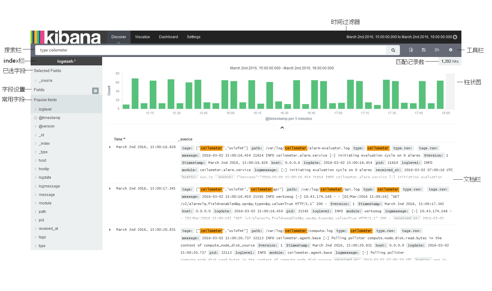
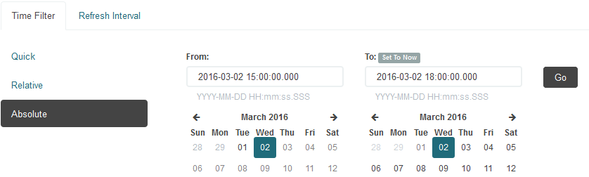
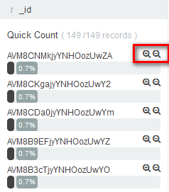
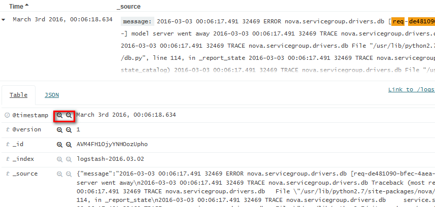

# ELK日志系统的discover界面使用指南
## 一 Kibana功能简介
kibana是基于elasticsearch的数据进行数据分析和可视化的开源软件。通过配置文件选择相应的elasticsearch实例；通过settings界面选择需要分析和可视化的elasticsearch的index匹配模式，至少选择一种index；discover界面提供实时搜索和分析功能；对于设定好的搜索模式，可以保存后在visualize界面设置图形化方式；之后在dashboard界面将多个visualize进行整合，作为日志管理系统的主界面。该dashboard界面也是可以做到实时更新的。
## 二 discover界面使用

discover界面主要是通过各种过滤器搜索日志，如时间、type、loglevel等，并对所搜索到的日志做简单统计。界面如下所示，index栏显示当前选择的elasticsearch中的index。以下只做引导式介绍。

### 1.时间过滤器使用
时间过滤器是进行日志检索的第一个设置，点击右上角“时间设置”，可以展开或收起时间过滤器选择框，如下

可以分别设置想要分析的日志时间段和实时更新功能。默认time filter：last 15 minutes，refresh interval：off。
### 2.搜索栏使用
**全字段匹配**：搜索功能的后台支持是elasticsearch，属于全文搜索引擎，可以通过双引号进行任何字符串的匹配，如"req-de481090-bfec-4aea-8252-90c27abe51bf - - - - -"

**使用字段**：Elasticsearch的数据源是经过logstash格式化的日志，该格式通过elasticsearch的mapping API对应到kibana的字段。在文档栏的source中可以查看到格式化后的日志，以及原日志。搜索时可以使用字段和逻辑表达，如type:ceilometer，type:ceilometer and loglevel:error等。这里注意，输入过程中kibana的搜索栏会动态解析搜索内容，搜索表达式输入过程中可能会显示红框，提示无法解析，待全部输入完全即可。

**逻辑表达**：Elasticsearch可以使用逻辑表达式构造搜索语句，关键词为：AND（and）、OR(or)和NOT(not)。如
搜索来自192.51.151.11,192.51.151.4和192.51.151.12这3个节点的日志，搜索表达式为：
```
hostip:192.51.151.11 OR hostip:192.51.151.4 OR hostip:192.51.151.12
```
搜索来自上诉3个节点中nova日志中还有instance: 92d423f8-b52c-4363-ab03-f79ceff0544e字段的部分，搜索表达式为：
```
(hostip:192.51.151.11 OR hostip:192.51.151.4 OR hostip:192.51.151.12) AND type:nova AND "instance: 92d423f8-b52c-4363-ab03-f79ceff0544e"
```

**使用一个段内的值**：对于数字型的一个段内的值，也可以进行搜索，如status:[400 TO 499]。

**使用过滤器**：过滤器可以叠加使用，只能够对已有字段进行设置。鼠标移动到对应字段，字段会变灰，并显示该字段统计量前五的数据，如下

点击对应+（正向过滤）、-（反向过滤）进行过滤。对所有字段的过滤，可以在文档栏的source中进行选择，如下

选择后的过滤器会显示在搜索栏下方，便于进行设置：

图标和文字可以达到相同的功能，分别是过滤器使能、禁用（不删除，以便随时使能）、反选、锁定（更改搜索内容不变更）和删除。

### 3.工具栏使用

过滤器设置好后，可以对该设置在工具栏中进行保存，作为visualize的数据源。三个图标分别是开始一个新的搜索、保存搜索、打开保存的搜索。

### 4.柱状图统计

柱状图实时对搜索内容进行统计，以时间作为横坐标，显示搜索到的总日志条数。也可以通过箭头按钮展开或折叠显示相应的文本记录。默认一页最多显示500条。鼠标移动到相应柱状，可显示对应条数，待变为十字，可以进行放大（zoon in）或缩小(zoon out)。

### 5.文档栏字段选择

默认文档栏只显示time和_source字段，需要调整显示字段，可以在页面左边字段选择框添加和删除。鼠标移动到相应字段，字段变灰，同时出现add或remove按钮。所选字段也可以进行移动布局，或排序。字段是否作为popular field，在settings中进行设置。
## 三、应用实例
### 1、 在一定时间范围内检索：
**检索日志的时间段： 2016-05-31 14:00 —— 2016-05-31 15:00**
step 1:点击右上角“时间设置”
step 2:在弹出的时间设置框中，点击时间过滤器 
step 3:点击绝对时间设置
step 4:在时间设置栏中输入需要检索时间段 
step 5:点击  完成检索。
### 2、在部分节点进行检索：
**在1所在时间条件下，检索ip地址为 192.51.151.4、192.51.151.11和192.51.151.12共3个节点的日志**
step 1:在搜索框中输入如下检索表达式
```
hostip:192.51.151.4 OR hostip:192.51.151.11 OR hostip:192.51.151.12
```
step 2:点击  完成检索
### 3、针对部分组件进行检索：
**在2所在时间条件下，检索nova组件的日志**
step 1:在搜索框中输入如下检索表达式
```
(hostip:192.51.151.11 OR hostip:192.51.151.4 OR hostip:192.51.151.12) AND type:nova
```
step 2:点击 完成检索
### 4、针对特定关键字进行检索：
**在3所在时间条件下，检索instance ID 为 92d423f8-b52c-4363-ab03-f79ceff0544e的日志**
step 1:在搜索框中输入如下检索表达式
```
(hostip:192.51.151.11 OR hostip:192.51.151.4 OR hostip:192.51.151.12) AND type:nova AND "instance: 92d423f8-b52c-4363-ab03-f79ceff0544e"
```
step 2:点击 完成检索


