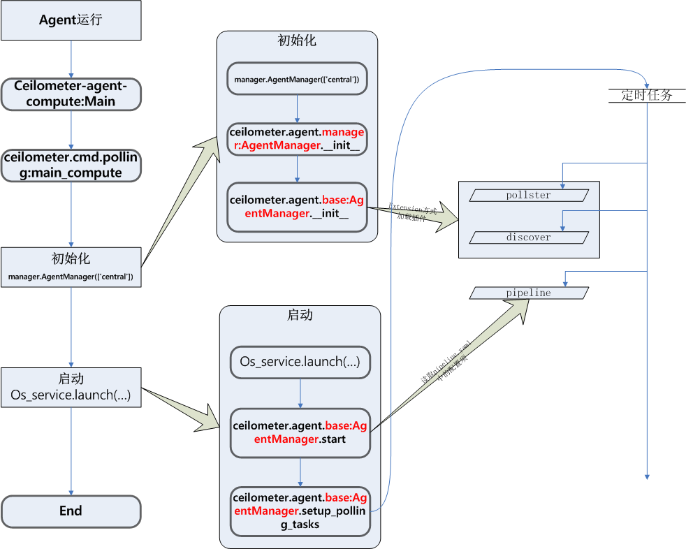

# ceilometer-agent-computer

　　Ceilometer Compute Agent服务组件主要用来收集计算节点上的虚拟机实例的监控数据，在每一个计算节点上都要运行这个服务组件。该agent通过Stevedore（[Python深入：stevedore简介](http://www.voidcn.com/blog/gqtcgq/article/p-4846113.html)）管理了一组pollster插件，分别用来获取计算节点上虚拟机的CPU、Memory、Disk IO、Network IO、Instance这些信息，这些信息大部分是通过调用Hypervisor的API来获取的，需要定期Poll轮询收集信息。



[toc]

## 注册插件
　　Pollster插件就是指各项采集指标的具体python实现文件，开发者每完成一个采集指标的插件实现，都需要在入口文件entry_points.txt找到命名空间`ceilometer.poll.compute`并注册，Agent借助Stevedore会将所有插件在启动时加载。
/usr/lib/python2.7/site-packages/ceilometer-2015.1.0-py2.7.egg-info/entry_points.txt
```
[ceilometer.poll.compute]
compute.node.disk.read.bytes = ceilometer.compute.pollsters.disk:NodeReadBytesPollster
disk.read.bytes = ceilometer.compute.pollsters.disk:ReadBytesPollster
network.outgoing.bytes.rate = ceilometer.compute.pollsters.net:OutgoingBytesRatePollster
compute.node.network.outgoing.bytes = ceilometer.compute.pollsters.net:NodeOutgoingBytesPollster
disk.write.bytes = ceilometer.compute.pollsters.disk:WriteBytesPollster
disk.capacity = ceilometer.compute.pollsters.disk:CapacityPollster
disk.total.size = ceilometer.compute.pollsters.disk:DiskTotalSizePollster
disk.usage = ceilometer.compute.pollsters.disk:PhysicalPollster
disk.read.bytes.rate = ceilometer.compute.pollsters.disk:ReadBytesRatePollster
cpu_util = ceilometer.compute.pollsters.cpu:CPUUtilPollster
network.incoming.bytes.rate = ceilometer.compute.pollsters.net:IncomingBytesRatePollster
memory = ceilometer.compute.pollsters.memory:MemoryPollster
disk.write.bytes.rate = ceilometer.compute.pollsters.disk:WriteBytesRatePollster
memory.usage = ceilometer.compute.pollsters.memory:MemoryUsagePollster
compute.node.network.incoming.bytes = ceilometer.compute.pollsters.net:NodeIncomingBytesPollster
network.outgoing.bytes = ceilometer.compute.pollsters.net:OutgoingBytesPollster
network.incoming.bytes = ceilometer.compute.pollsters.net:IncomingBytesPollster
compute.node.disk.write.bytes = ceilometer.compute.pollsters.disk:NodeWriteBytesPollster
disk.allocation = ceilometer.compute.pollsters.disk:AllocationPollster
compute.node.network.bandwidth = ceilometer.compute.pollsters.net:NodeBandwidthPollster
vcpus = ceilometer.compute.pollsters.cpu:VCPUSPollster
cpu = ceilometer.compute.pollsters.cpu:CPUPollster

```
    
## 初始化操作
服务的初始化操作主要实现了以下内容的操作：

- 先根据指定参数获取agent的命名空间**ceilometer.poll.compute**，然后获取与``ceilometer.poll.compute``相匹配的所有插件，并加载；``ceilometer.poll.compute``所指定的插件描述了如何获取收集所监控的虚拟机实例相关的监控采样数据；
- 根据指定参数获取命名空间**ceilometer.discover**，获取与`ceilometer.discover`相匹配的所有插件，并加载；`ceilometer.discover`所指定的插件描述了如何发现主机上的监控的虚拟机:
```
ceilometer.discover = 
	local_instances = ceilometer.compute.discovery:InstanceDiscovery
```
- 获取管理员操作的上下文环境类的初始化对象；
- 建立线程池，用于后续服务中若干操作的运行；
- ~~加载命名空间ceilometer.compute.virt，描述了获取虚拟机实例的信息（实例数据，CPU数据，网卡数据和磁盘数据等）的方式；~~

/usr/lib/python2.7/site-packages/ceilometer/agent/base.py：
``` python
class AgentManager(os_service.Service):

    def __init__(self, namespaces, pollster_list, group_prefix=None):
        super(AgentManager, self).__init__()

         """
        加载命名空间ceilometer.poll.compute的所有插件：
         """
        extensions = (self._extensions('poll', namespace).extensions
                      for namespace in namespaces)

        """
        加载命名空间所有插件ceilometer.discover：
        """
        self.discovery_manager = self._extensions('discover')

        """
        获取管理员操作的上下文环境类的初始化对象：
        """
        self.context = context.RequestContext('admin', 'admin', is_admin=True)

    def _extensions(category, agent_ns=None):
        """
        根据指定参数拼接出命名空间namespace，
        """
        namespace = ('ceilometer.%s.%s' % (category, agent_ns) if agent_ns else 'ceilometer.%s' % category)
        """
        获取与该namespace相匹配的所有插件，并加载；
        这时候的namespace就等于 ceilometer.poll.compute
        """
        return extension.ExtensionManager(
            namespace=namespace,
            invoke_on_load=True,
        )
```

## 启动操作
ceilometer-agent-central的启动操作实现以下任务：

- 遍历配置文件pipeline.yaml，获取每个监控项的采样配置、数据的加工方式以及数据的发布方式；
- 以采集周期为key创建定时任务列表，并将待采集任务添加到对应采集周期的定时任务列表中。例如创建600s的定时任务，并将“采集CPU指标并上报原始数据”和“采集CPU指标并上报加工后数据”都加入了600s的任务列表里。
注意：因pipeline.yaml里的meter_source项的默认配置是"\*"，故entry_points.txt里定义的所有采集指标都会有对应一个**采集并上报原始数据**任务并加入600s的任务列表里。如果不想上报原始数据，则配置项应改为：`"!*"`
/etc/ceilometer/pipeline.yaml：
```
sources:
     - name: meter_source
        interval: 600
        meters:
            - "*"
        sinks:
            - meter_sink
```

再来看启动流程：
``` python
class AgentManager(os_service.Service):
    def start(self):
        """
        读取pipeline.yaml
        """
        self.pipeline_manager = publish_pipeline.setup_pipeline()
         ……
        for interval, task in six.iteritems(self.setup_polling_tasks()):
            delay_time = (interval + delay_polling_time if delay_start
                          else delay_polling_time)
            self.tg.add_timer(interval,
                              self.interval_task,
                              initial_delay=delay_time,
                              task=task)

    def setup_polling_tasks(self):
        polling_tasks = {}
        """
        Self.extensions就是保存的从entry_points.txt里读取的采集指标插件
         任意一个pipeline和extensions组成一对，定义了采集项的周期，数据源，上报格
         式等，将此采集项加入到某个定时任务列表中，该定时任务的周期就是采集项的周期
        """
        for pipeline in self.pipeline_manager.pipelines:
            for pollster in self.extensions:
                if pipeline.support_meter(pollster.name):
                    polling_task = polling_tasks.get(pipeline.get_interval())
                    if not polling_task:
                        polling_task = self.create_polling_task()
                        polling_tasks[pipeline.get_interval()] = polling_task
                    polling_task.add(pollster, pipeline)

        return polling_tasks
```
定时任务创建后，之后的事情就是周期执行定时任务，获取数据并上报。
具体的单个polling_task的运行：
```python
class AgentManager(os_service.Service):
    def poll_and_publish(self):
        """
        创建轮徇的任务；
        任务以一定时间间隔周期性地进行；

        遍历任务（通道），获取每个任务指定获取的监控项的采样数据；
        针对每个监控项的采样数据，实现发布监控项采样数据样本到消息队列；
        """
        """
        通过nova客户端访问nova数据库，获取本地主机上所有的虚拟机实例；
        """
         cache = {}
         discovery_cache = {}

        """
        遍历pipeline里定义的所有sources
        """
         for source_name in self.pollster_matches:
            with self.publishers[source_name] as publisher:
               """
               遍历每个source的meter项
               """
                for pollster in self.pollster_matches[source_name]:
                    key = Resources.key(source_name, pollster)
					"""
                    get_samples：获取nova管理下虚拟机实例的某一监控项的采样数据
                    注：这些信息大部分是通过调用Hypervisor的API来获取的，Ceilometer提供
                    了Libvirt的API和Hyper-V的API:
                    CPUPollster.get_samples
                    CPUUtilPollster.get_samples
                    _DiskRatesPollsterBase.get_samples
                    InstancePollster.get_samples
                    InstanceFlavorPollster.get_samples
                    MemoryUsagePollster.get_samples
                    """
                    try:
                        samples = list(pollster.obj.get_samples(
                            manager=self.manager,
                            cache=cache,
                            resources=polling_resources
                        )) 
                    """
                    实现发布监控项采样数据样本；
                    """
                    publisher(samples)

```

## 如何扩展采集项
参考：
[openstack监控扩展](http://www.cnblogs.com/yippee/p/4645469.html)

# 参考资料：
[Ceilometer 中 meter 的流程（一）](http://lyang.top/2015/12/26/Ceilometer-%E4%B8%AD-meter-%E7%9A%84%E6%B5%81%E7%A8%8B%EF%BC%88%E4%B8%80%EF%BC%89/)

[Ceilometer 源码学习 - Polling Agent](http://catkang.github.io/2015/11/03/source-ceilometer-polling.html)

[openstack监控扩展](http://www.cnblogs.com/yippee/p/4645469.html)

[一個meter的旅行](http://www.xlgps.com/article/20358.html)


