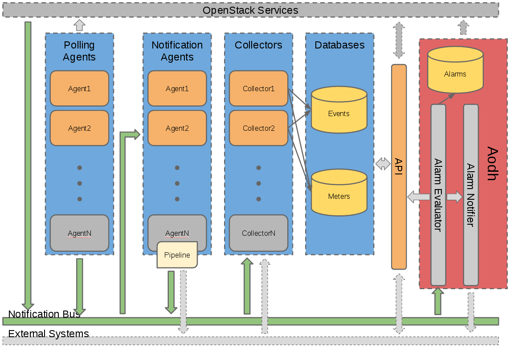
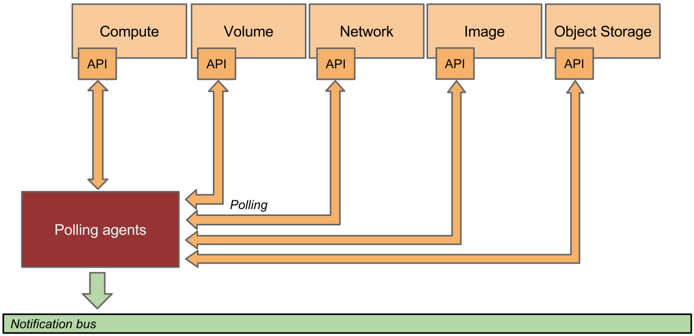

# Ceilometer架构分析
> Ceilometer是Openstack中的计量/监控组件，从2012年开始成为社区的核心项目,受到广泛开发者的关注。它是把Openstack内部发生的几乎所有事情都搜集起来，为和监控以及其他服务提供了数据支撑，但计费功能社区没有，需要自己在开发计费系统。经过几年的发展ceilometer功能越来越完善，能够统计许多资源的使用情况，功能易于扩展支持第三方的plugin。唯一的缺点是实时统计的数据随时间增长巨大，对系统整体性能有严重影响。好消息是从Liberty版本对ceilometer之前存在的性能问题有所改进，维持社区提出了adoh和gnocchi项目。本文中对ceilometer基本组件、功能进行分析，暂不涉及aodh和gnocchi。

[toc]

## 概述
Ceilometer组件的目标是为计费系统提供所需的测量指标，以便于生成用户账单。相关计量项覆盖了所有当前OpenStack的核心组件，同时也会支持未来OpenStack的其它组件。
•	Ceilometer项目开始于2012年，最初用于一个简单目标：收集OpenStack项目的信息，计费系统使用该数据源生成费用账单，称之为“计量”。 
•	随后，Ceilometer收集的指标越来越多，社区开始给Ceilometer增加第二个目标：成为一个标准的采集指标机制，而不管指标的用途。 
•	最近，随着Heat项目的诞生，OpenStack项目需要一个工具来观察关键变量，并触发不同的响应。因为Ceilometer已经收集了大量的指标，该工作顺理成章的成为了Ceilometer的扩展，称之为“告警”。 在M版本，该功能又从Ceilometer移出，独立出新的Openstack组件：Aodh，

## 系统架构

### 高层体系架构
---

如上图所示，Ceilometer每个服务都支持弹性伸缩：管理员可根据系统的负荷调整woker或者node。Ceilometer有3个核心服务：2个获取所需数据的agent，1个搜集并保存数据的agent，两类agent相互独立，又相互协作，完成Ceilometer相关功能

1. polling agent: 从Openstack各服务或libvrit等轮询数据
2. notification agent: 监听消息队列，捕获到通知后，将数据转换为 Sample和Event。
3. (可选)collect：从消息队列搜集以上agent经常获取的event和metering数据并保存
4. (可选)api: 查询由collect保存下来的数据

Ceilometer需要采集的数据越来越多，旧的存储机制已成为瓶颈。为解决此问题，Openstack社区开发了一个新项目：Gnocchi（Gnocchi是一个时间序列存储后端，它对存储和检索时间序列的数据有着天然的性能优势），专门向外提供Metric数据的存储和查询服务。

### 搜集数据
---

#### 如何搜集数据
---

上图展示了Polling agent和Notification agent如何分工协作，从多个源头采集所需数据。
Ceilometer有两种方案采集数据：
1. 被动监听(notification agent)，捕获各Openstack服务推送至消息服务器的数据，这是数据采集的首选方案。
2. 主动轮询(polling agent)，定时调用个Openstack服务的API接口以及libvirt接口获取采集数据。因定时轮训API接口会对Openstack服务造成负荷，故是次选方案。

#### Notification Agents: 被动监听消息总线，获取数据
---

系统的主体就是notification进程(agen-notification)。notification agent监听消息总线，Openstack各服务(如Nova, Glance, Cinder, Neutron, Swift, Keystone, Heat, 甚至Ceilometer自身)将Ceilometer所需数据推送至消息队列。
Notification进程在启动时会加载命名空间为`ceilometer.notification`的所有插件。插件跟根据配置监听任一`topic`的消息队列，默认监听`notifications.info`。

#### Polling Agents: 主动轮询，索取数据
---

Polling agent进程主动向目标查询数据，如按数据源划分，polling agent承担两种角色：
1. 调用agent进程所在的宿主机的hypervisor接口获取数据，旧版本的computer-agent进程就实现此功能。
2. agent进程运行在云控制节点，调用各Openstack服务的API获取数据，旧版本的ccentral-agent进程就实现此功能。
如果一个小型的系统，采用all-in-one的部署方式，那一个polling agent就可以同时完成上述两项功能；反之，如果是一个大型的、复杂的系统，那可以部署多个polling agent，每个agent由其命名空间指定其需加载的插件。命名空间可作为运行参数传递给agent，可选参数包括`ceilometer.poll.compute`和`ceilometer.poll.central`，这两个参数可以同时选中，也可只选一个。

Polling agent定时调用插件获取数据，定时器的周期由pipeline配置项(缺省配置文件为pipeline.yamnl)指定，获取到数据后，agent就把消息推送至消息服务器中，由notification agent做进一步处理。

